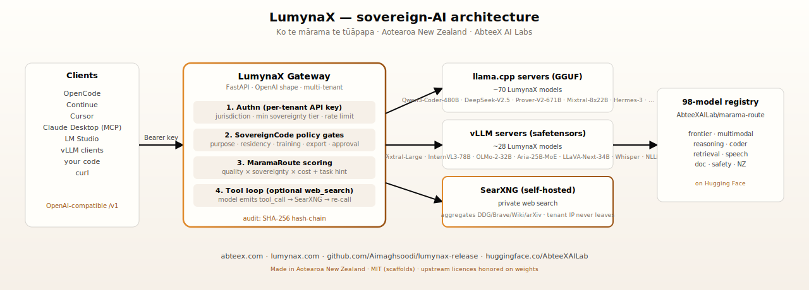

# LumynaX

> **Sovereign intelligence, held in the light.**
> *Ko te mārama te tūāpapa.*

98 production-ready AI models — frontier MoE, multimodal, coding specialists, reasoning, long-context, speech, retrieval — published by **AbteeX AI Labs** in **Aotearoa New Zealand**. One OpenAI-compatible API, policy-gated, audit-logged, deployable anywhere from a laptop to an enterprise cluster.

[](https://huggingface.co/AbteeXAILab) [](https://huggingface.co/AbteeXAILab) [](LICENSE) [](https://abteex.com)

<p align="center"></p>

## Three commands to first response

```bash
# 1. Start the stack (gateway + private web-search + sample models)
docker compose -f deployments/docker-compose.yml up -d

# 2. Ask the router which model fits the request
curl -H "Authorization: Bearer lumynax-local-dev" \
     "http://localhost:8080/v1/route?requires_local=true&jurisdiction=NZ&modalities=text"

# 3. Chat with it
curl -H "Authorization: Bearer lumynax-local-dev" -H "Content-Type: application/json" \
     -d '{"model":"lumynax-coder-deepseek-v2-lite-16b-gguf","messages":[{"role":"user","content":"Hello"}]}' \
     http://localhost:8080/v1/chat/completions
```

Prefer Python? `pip install lumynax && lumynax run lumynax-chat-hermes-3-llama31-8b-gguf -i`

Prefer Claude Desktop / Cursor / Zed? `pip install lumynax-mcp` and add to your MCP config — every LumynaX model becomes a callable tool.

## What's in here

| Path | What |
| --- | --- |
| [`models/`](models/) | 98 model scaffolds — `quickstart.py`, `requirements.txt`, `Modelfile`, manifest, Space, docs. Weights live on HF. |
| [`products/sovereigncode/`](products/sovereigncode/) | Local-first coding agent with Data Capsule policy and hash-chained audit. |
| [`products/marama-route/`](products/marama-route/) | Sovereign router across the 98-model family. |
| [`spaces/`](spaces/) | Three Gradio Spaces — gateway-aware demos of SovereignCode, MaramaRoute, and live chat. |
| [`deployments/`](deployments/) | Docker Compose, Helm chart, gateway, SearXNG. Production-ready. |
| [`tools/lumynax-cli/`](tools/lumynax-cli/) | `lumynax` and `lumynax-gateway` CLIs. |
| [`tools/lumynax-mcp/`](tools/lumynax-mcp/) | MCP server for Claude Desktop / Cursor / Zed. |
| [`evals/`](evals/) | Benchmark harness — HumanEval, MMLU, MTEB, LibriSpeech. Numbers vs upstream. |
| [`training/lumynax-nz/`](training/lumynax-nz/) | Recipe to fine-tune a 3B model on Aotearoa NZ corpora (Hansard, Statutes, te reo Māori). |
| [`registry/lumynax_model_registry.json`](registry/) | Authoritative model registry. Mirrored to `AbteeXAILab/marama-route` on HF. |
| [`scripts/e2e_smoke.sh`](scripts/) | End-to-end smoke test. Run before shipping. |
| [`DEPLOYMENT.md`](DEPLOYMENT.md) | Single-node, Kubernetes, air-gapped paths. |
| [`INTEGRATIONS.md`](INTEGRATIONS.md) | vLLM, LM Studio, OpenCode, Continue, Ollama, llama.cpp — every runtime. |

## The 98 models — by tier

| Tier | What | Examples |
| --- | --- | --- |
| 🏔 **Frontier** | 70B-671B params, MoE and dense | Qwen3-235B · DeepSeek-V2.5 · GLM-4.6-355B · Qwen2.5-72B · MiniMax-M2 · Mixtral-8x22B · OLMo-2-32B · QwQ-32B · Phi-4 |
| 👁 **Multimodal** | vision + audio | Pixtral-Large · Qwen2.5-VL-72B · InternVL3-78B · Aria-25B-MoE · LLaVA-Next-34B · Whisper-v3-Turbo · Kokoro TTS |
| 🧠 **Reasoning & long-context** | step-by-step + 200K-1M ctx | DeepSeek-R1-Distill · DeepSeek-Prover-V2-671B · Phi-3.5-MoE · Yi-9B-200K · GLM-4-9B-1M · ProLong-512K |
| 💻 **Coding** | frontier → tiny | Qwen3-Coder-480B · DeepSeek-V2.5-1210 · CodeLlama-70B · DeepSeek-Coder-33B · Qwen2.5-Coder-32B · StarCoder2-15B · Yi-Coder-9B |
| 🔍 **Retrieval & safety** | embeddings + reranker + content guard | BGE-M3 · Nomic-Embed-v2-MoE · Granite-Multilingual · BGE-reranker-v2 · Text-Moderation |
| 🌿 **NZ + specialty** | te reo Māori, doc-AI, OCR, tiny | NLLB-200-3.3B · TrOCR · Nougat · LayoutLMv3 · LumynaX-NZ-3B *(coming)* |

Full [registry JSON](registry/lumynax_model_registry.json) · [Hugging Face Collections](https://huggingface.co/AbteeXAILab)

## Sovereignty contract

Every model card and every gateway request carries:

- **Residency tag** — NZ / AU / global. Requests with the wrong jurisdiction are denied.
- **Sovereignty tier** — 1 (remote frontier) to 5 (NZ-resident local-only).
- **Policy gates** — purpose, residency, remote-model, training, export, human approval. Each denied request emits a hash-chained audit record.
- **Provenance** — every model's `release_export_manifest.json` documents upstream repo, licence, GGUF mirror, and SHA-256 of the runtime scaffold.

## Companion products

| Product | What | Live |
| --- | --- | --- |
| [SovereignCode](products/sovereigncode/) | Data Capsule policy engine + audit ledger | [Space](https://huggingface.co/spaces/AbteeXAILab/sovereigncode-demo) |
| [MaramaRoute](products/marama-route/) | Sovereign model router | [Space](https://huggingface.co/spaces/AbteeXAILab/marama-route-demo) |
| LumynaX Live | Browser chat with the family | [Space](https://huggingface.co/spaces/AbteeXAILab/lumynax-live-demo) |
| [`lumynax`](tools/lumynax-cli/) CLI | `lumynax route / serve / opencode / continue / vllm / lm-studio` | `pip install lumynax` |
| [`lumynax-mcp`](tools/lumynax-mcp/) | MCP server for Claude Desktop / Cursor / Zed | `pip install lumynax-mcp` |

## License

- **Scaffolds, tooling, gateway** — MIT (© AbteeX AI Labs)
- **Weights** — each model's upstream licence (Apache-2.0, MIT, Llama, Qwen, Mistral-Research, etc.), unchanged

## Made in Aotearoa New Zealand

By **AbteeX AI Labs** · [abteex.com](https://abteex.com) · [lumynax.com](https://lumynax.com)

*Ko te mārama te tūāpapa — the light is the foundation.*
